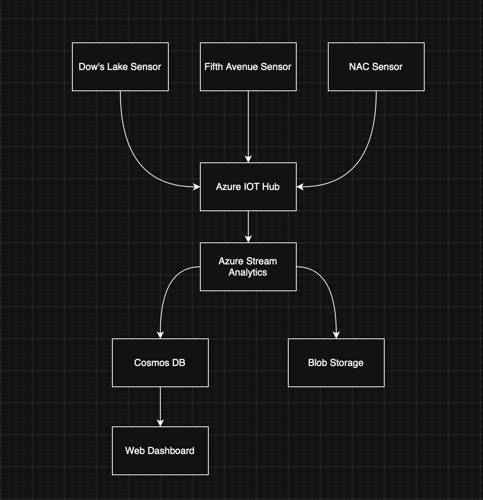

# CST8916 Final Project - Real-time Monitoring System for Rideau Canal Skateway

## 1. Brief Description

## 2. Student Information

- Desmond Murphy - 040946131

- [CST8916 Final Project](https://github.com/demurphyh/cst8916-final-project)
- [Rideau Canal Sensor Simulator](https://github.com/demurphyh/rideau-canal-sensor-simulation)
- [Rideau Canal Dashboard](https://github.com/demurphyh/rideau-canal-dashboard)

## 3. Scenario Overview

### Problem Statement

- The NCC requires a real-time data streaming and visualization system to be built in order to provide constant monitoring of the rideau canal ice surface to ensure skater safety.

### System Objectives

The system must:

- Simulate IoT sensors at Dow's Lake, Fifth Avenue, NAC to monitor:

  - Ice Thickness (cm)
  - Surface Temperature (°C)
  - Snow Accumulation (cm)
  - External Temperature (°C)

- Process data in real-time using Azure Stream Analytics with 5-minute aggregation windows

- Store procesed data in Azure Cosmos DB for fast access

- Archive Historical data in Azure Blob Storage

- Display live data through a web dashboard on Azure App Service

## 4. System Architecture

### Architecture diagram (in architecture/ folder)



### Data flow explanation

1. Data flows from the simulated sensor devices into the IoT hub
2. Data goes from the IoT hub to Azure Stream Analytics to be analysed
3. Data is transferred to Cosmos DB
4. Data flows to Blob storage and is stored for historical data archives
5. Data in Cosmos is then displayed on the dashboard

### Azure services used

- IoT Hub with three IoT devices

- Azure Stream Analytics

- Azure Cosmos DB

- Azure Blob Storage

- Azure App Service

## 5. Implementation Overview

- IoT Sensor Simulator

  - Python script simulated the data we would receive from three real IoT devices located at Dow's Lake, Fifth Avenue and the NAC that sent data every 10 seconds to the Azure IoT hub relating to the ice status.
  [Sensor Simulator Repo](https://github.com/demurphyh/rideau-canal-sensor-simulation)

- Azure IoT Hub - Data ingestion from sensors

  - Azure IoT hub receives data from the three simulated IoT devices and acts as the input for Azure Stream Analytics job.

- Azure Stream Analytics - Real-time data processing

  - Input: IoT Hub
  
  - Output: Cosmos DB and Blob Storage

  - Tumbling Window: 5 Minutes

  - Query:

```SQL
SELECT
    System.Timestamp AS windowEnd,
    location,
    
    AVG(iceThickness) AS avgIceThickness,
    MIN(iceThickness) AS minIceThickness,
    MAX(IceThickness) AS maxIceThickness,

    AVG(surfaceTemperature) AS avgSurfaceTemp,
    MIN(surfaceTemperature) AS minSurfaceTemp,
    MAX(surfaceTemperature) AS maxSurfaceTemp,

    MAX(SnowAccumulation) AS maxSnowAccumulation,
    AVG(externalTemp) AS avgExternalTemp,

    COUNT(*) AS readingCount,

    CASE 
        WHEN AVG(iceThickness) >= 30 THEN 'Safe'
        WHEN AVG(iceThickness) >= 20 THEN 'Caution'
        ELSE 'Unsafe'
    END AS safetyStatus
INTO
    [SensorAggregations]
FROM
    [icesensors] TIMESTAMP BY timestamp
GROUP BY
    TUMBLINGWINDOW(minute, 5),
    location;

SELECT *
INTO [outputblob]
FROM [iceSensors] TIMESTAMP BY timestamp;
```

- Azure Cosmos DB - NoSQL database for dashboard queries

  - Database: `RideauCanalDB`

  - Container: `SensorAggregations`

  - Partition Key: `/location`

  - Cosmos DB store the aggregated 5 minute data received from the Azure Stream Job.

- Azure Blob Storage - Historical data archival

  - Container: `historical-data`

  - Path Pattern: `aggregations/{date}/{time}`

  - Format: JSON

  - Azure Blob Storage is used to store all of the historical data received from the simulated IoT devices.

- Web Dashboard - Data Visualization

  - Backend: Node.js with Express

  - Database SDK: `@azure/cosmos`

  - HTML/CSS/JavaScript with Chart.js

  - Features:
  
    - Real-time data display across three locations (Dow's Lake, Fifth Avenue, NAC)
    - Safety Status Badges
    - Auto-refresh capability
    - Historical trends
    - Overall System Status through API
    - [Dashboard Repo](https://github.com/demurphyh/rideau-canal-dashboard)

- Azure App Service - Web dashboard hosting

  - Ice status dashboard is deployed to Azure App Services as a Node.js application
  - Azure App Service automatically creates a publicly accesible URL
  - Azure Cosmos DB are entered into settings instead of using .env file like local deployment

## 6. Repository Links

- [CST8916 Final Project](https://github.com/demurphyh/cst8916-final-project)
- [Rideau Canal Sensor Simulator](https://github.com/demurphyh/rideau-canal-sensor-simulation)
- [Rideau Canal Dashboard](https://github.com/demurphyh/rideau-canal-dashboard)

### 7. Video Demonstration

[Video Demonstration](https://youtu.be/qFshoAMxWNg)

### 8. Setup Instructions

### Prerequisites

- Access to an Azure Subscription
- Node 20 +
- Python 3.13 +
- Git to clone repos

### High-level setup

- Clone the repos:
  - [CST8916 Final Project](https://github.com/demurphyh/cst8916-final-project)
  - [Rideau Canal Sensor Simulator](https://github.com/demurphyh/rideau-canal-sensor-simulation)
  - [Rideau Canal Dashboard](https://github.com/demurphyh/rideau-canal-dashboard)
- Creat IoT Hub on Azure portal with devices for the three locations:
  - Dow's Lake
  - Fifth Avenue
  - NAC
- Create Cosmos DB with the instructions in step 4
- Create blob storage with instructions in step 4
- Create stream analytics job with the script found at /stream-analytics/query.sql using the IoT hub as the input and the two data storages as outputs
- Create python virtual environment for rideau-canal-sensor
- Install dependencies into venv `pip install -r requirements.txt`
- Run script  `python sensor_simmulator.py`
- Start stream analytics job
- Run dashboard locally `node ./server.js`
- Run dashboard by deploying on Azure App Services

### Links to detailed setup

- [In-depth Sensor Simulator Instructions](https://github.com/demurphyh/rideau-canal-sensor-simulation/blob/main/README.md)
- [In-depth Dashboard Instructions](https://github.com/demurphyh/rideau-canal-dashboard/blob/main/README.md)

## 9. Results and Analysis

### Sample Outputs

- Sample outputs from sensors:
  - `Sent from Dow's Lake: {'timestamp': '2025-12-10T18:54:38.354235+00:00', 'location': "Dow's Lake", 'iceThickness': 10.01, 'surfaceTemperature': -22.97, 'snowAccumulation': 33.62, 'externalTemp': -19.42}`

  - `Sent from Fifth Avenue: {'timestamp': '2025-12-10T18:54:38.559802+00:00', 'location': 'Fifth Avenue', 'iceThickness': 12.24, 'surfaceTemperature': -1.66, 'snowAccumulation': 33.0, 'externalTemp': -27.57}`

  - `Sent from NAC: {'timestamp': '2025-12-10T18:54:38.718581+00:00', 'location': 'NAC', 'iceThickness': 38.7, 'surfaceTemperature': -10.18, 'snowAccumulation': 36.06, 'externalTemp': -15.74}`

### Data Analysis and System Performance Observations

- JSON Data received from IoT sensors every 10 seconds then ingested from stream analytics to the various databases
- Data moved through the pipeline without any issues
- Stream analytics ingested data from IoT hub every 5 minutes due to Tumbling Window

### 10. Challenges and Solutions

- Had issues deploying the dashboard initially due to a crypto error
  - Upgraded from node 18 to node 21.7.1 and the crypto issue went away
- Had issues getting data to display on the dashboard
  - Adjusted the variable names and everything populated on the dashboard
- Was unable to get the data on the dashboard when deployed to Azure App Services I believe due to entering the connection keys wrong in App settings.

### 11. AI Tools Disclosure (if used)

## AI Tools Used

- **Tool:** ChatGPT
- **Purpose:** Code generation
- **Extent:** I created the initial sensor script and sql query based on the week 11 demonstration video for IoT hub and stream analytics but used ChatGPT to improve it and trouble shoot it when it wasn't working initially and then edited it more so the variables were correct.

### 12. References

[Week 11 Walkthrough](https://www.youtube.com/watch?v=pBcOtfC_Aiw&embeds_referring_euri=https%3A%2F%2Fbrightspace.algonquincollege.com%2F&source_ve_path=MjM4NTE)
